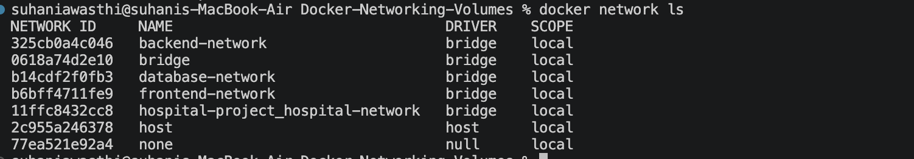
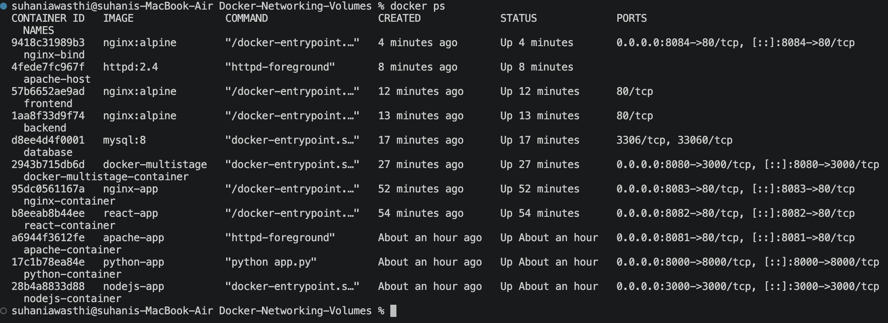
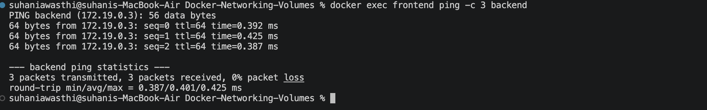
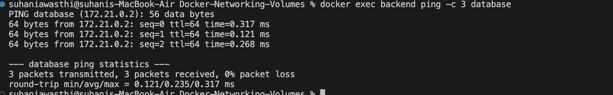

# Docker Networking and Volumes Homework

**Name:** Suhani Awasthi  
**Enrollment Number:** 24bcs10260

---

## Task 1: Docker Container Networking

For this task, I created three Docker containers:

- Frontend
- Backend
- Database

I created three separate Docker bridge networks:

- `frontend-network`
- `backend-network`
- `database-network`

The Backend container was connected to multiple networks so that it could communicate with both the Frontend and Database.

### Docker Networks

The three custom networks were created using:

```bash
docker network create frontend-network
docker network create backend-network
docker network create database-network
```

The networks were checked using:

```bash
docker network ls
```



All three networks were created successfully and use the `bridge` driver.

---

### Database Container

I created a MySQL container using:

```bash
docker run -d \
  --name database \
  --network database-network \
  -e MYSQL_ROOT_PASSWORD=rootpass \
  -e MYSQL_DATABASE=studentdb \
  mysql:8
```

The Database container is connected to `database-network`.

---

### Backend Container

I created the Backend container using Nginx:

```bash
docker run -d \
  --name backend \
  --network backend-network \
  nginx:alpine
```

Then I connected the Backend to the other required networks:

```bash
docker network connect database-network backend
docker network connect frontend-network backend
```

Therefore, the Backend can communicate with the Frontend and Database.

---

### Frontend Container

I created the Frontend container using:

```bash
docker run -d \
  --name frontend \
  --network frontend-network \
  nginx:alpine
```

The running containers were checked using:

```bash
docker ps
```



---

### Checking Connectivity

I checked the connectivity between the Frontend and Backend using:

```bash
docker exec frontend ping -c 3 backend
```

The ping was successful with **0% packet loss**.



I also checked the connectivity between the Backend and Database:

```bash
docker exec backend ping -c 3 database
```

This was also successful with **0% packet loss**.



This confirms that the containers can communicate through their respective Docker networks.

---

## Task 2: Host Network

For this task, I pulled the Apache2 image from Docker Hub:

```bash
docker pull httpd:2.4
```

Then I created an Apache container using the host network:

```bash
docker run -d --name apache-host --network host httpd:2.4
```

I verified that the container was using the host network with:

```bash
docker inspect apache-host | grep -A 5 '"Networks"'
```

The output showed:

```text
"Networks": {
    "host": {
```


I also checked the Apache configuration using:

```bash
docker exec apache-host httpd -S
```

The configuration was valid and Apache was running normally.

### Note

Since I am using Docker Desktop on macOS, accessing the host-networked Apache directly through `localhost:80` did not work in my setup. The container itself was running correctly and was confirmed to be using the `host` network.

---

## Task 3: Bind Mount

For this task, I created a local folder:

```bash
mkdir -p bind-mount
```

Then I created an `index.html` file:

```bash
echo "<h1>Hello students</h1>" > bind-mount/index.html
```

The file was checked using:

```bash
cat bind-mount/index.html
```

I then started an Nginx container with the local folder mounted into the container:

```bash
docker run -d \
  --name nginx-bind \
  -p 8084:80 \
  -v "$(pwd)/bind-mount:/usr/share/nginx/html" \
  nginx:alpine
```

I opened the application in the browser at:

```text
http://localhost:8084
```

The page displayed:

**Hello students**


### Modifying the File

I changed the `index.html` file on my local machine:

```bash
echo "<h1>Hello students - Updated</h1>" > bind-mount/index.html
```

I refreshed the browser without restarting the Nginx container.

The updated content was displayed:

**Hello students - Updated**


This shows that changes made to the file on the host were immediately reflected inside the running container because of the bind mount.

---

## Task 4: Overlay Network

An Overlay network is a Docker network that allows containers running on different Docker hosts to communicate with each other.

It is mainly useful when Docker is running across multiple machines, such as in a Docker Swarm cluster.

For example:

```text
Docker Host 1              Docker Host 2

Frontend                   Backend
    |                         |
    +------ Overlay Network --+
```

The containers can communicate through the overlay network even though they are running on different Docker hosts.

### Use Cases

Some common use cases are:

- Docker Swarm
- Microservices
- Distributed applications
- Communication between containers on different Docker hosts

The networks created in Task 1 were bridge networks because the containers were running on the same Docker host.

---

## Conclusion

In this homework, I learned how Docker networking allows containers to communicate with each other using different networks.

I also learned how host networking works, how to use bind mounts to share files between the host and a container, and how overlay networks can be used for communication between containers running on different Docker hosts.