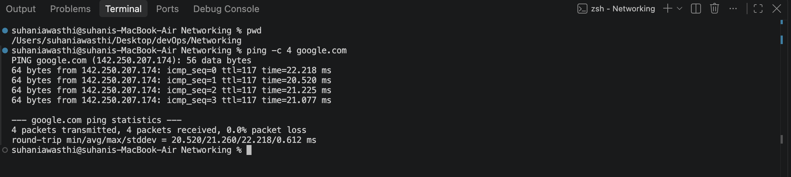
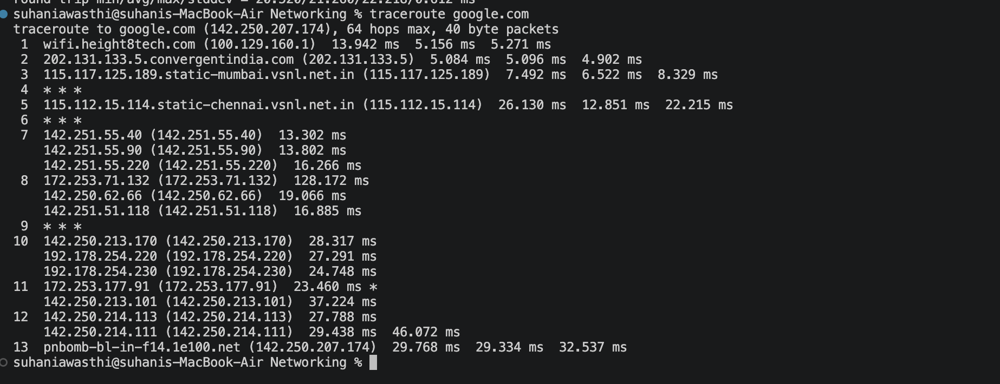
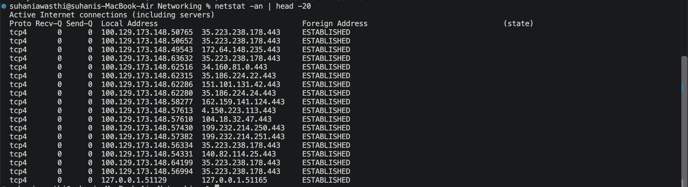
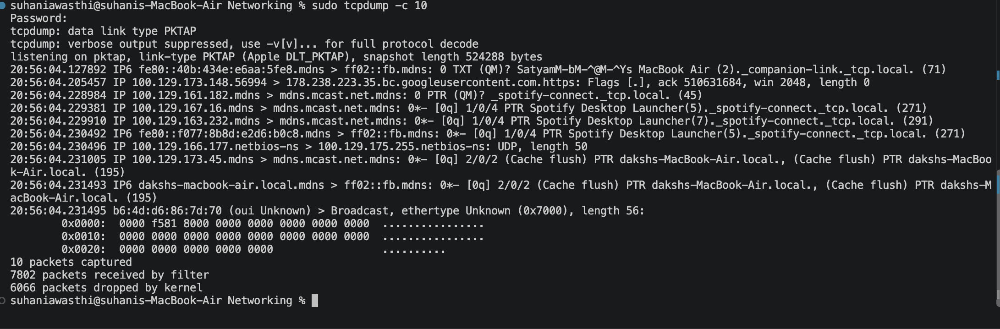
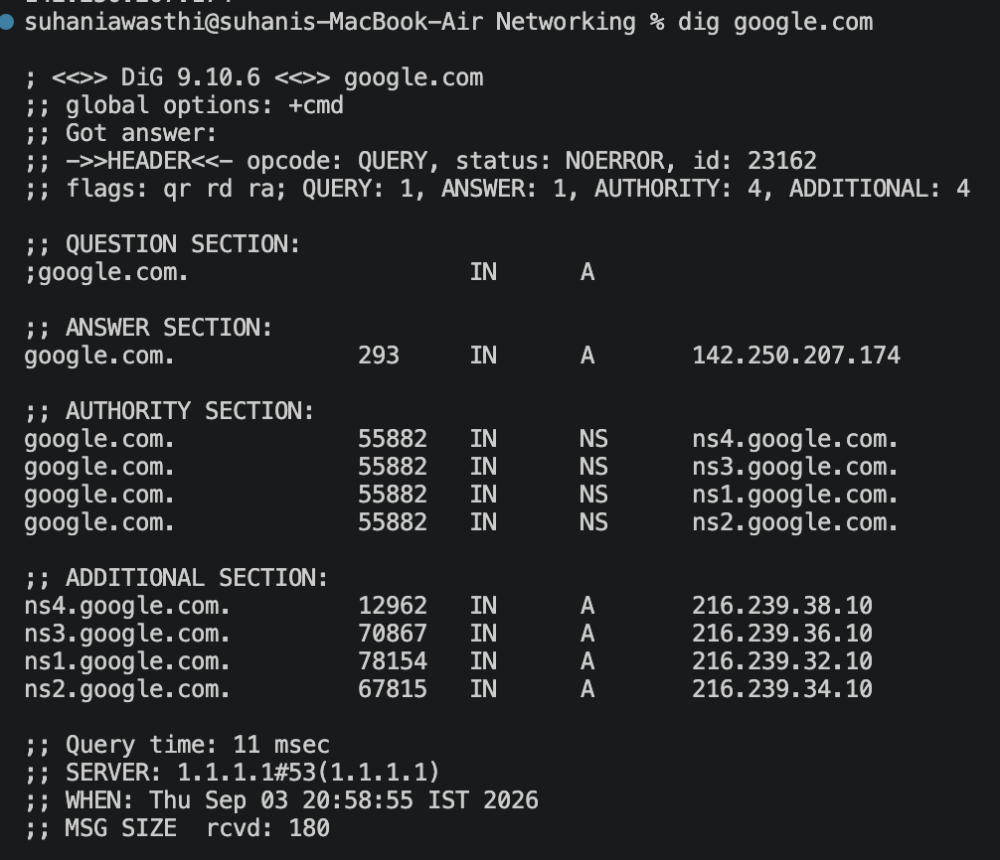
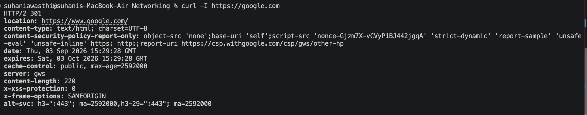
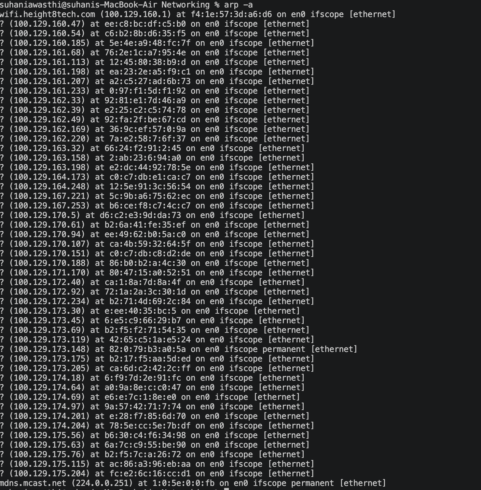

# Networking Commands — Troubleshooting Notes

## Description

In this task, I practiced some common networking commands and checked their output on my Mac. I used these commands to understand basic network connectivity, DNS, network connections, packet traffic and network configuration.

---

## 1. Ping

### Command

```bash
ping -c 4 google.com
```

### Output



### What I understood

`ping` is used to check whether a destination is reachable over the network. It also shows the response time and packet loss, which can help in checking network connectivity.

---

## 2. Traceroute

### Command

```bash
traceroute google.com
```

### Output



### What I understood

`traceroute` shows the different network hops between my computer and the destination. It can help identify where delays or connectivity issues are happening.

---

## 3. Netstat

### Command

```bash
netstat -an
```

### Output



### What I understood

`netstat` shows information about network connections and ports. It can be used to check active connections and ports that are being used or are listening.

---

## 4. Telnet / Netcat

### Command

```bash
nc -vz google.com 80
```

### Output


### What I understood

I used Netcat (`nc`) because Telnet was not available by default on my Mac. It helped me check whether I could establish a connection to Google's port 80.

---

## 5. Tcpdump

### Command

```bash
sudo tcpdump -c 10
```

### Output



### What I understood

`tcpdump` is used to capture and display network packets. It helps in understanding what kind of network traffic is going through the system.

---

## 6. Nslookup

### Command

```bash
nslookup google.com
```

### Output


### What I understood

`nslookup` is used to query DNS information. It helped me find the IP address associated with the domain `google.com`.

---

## 7. Dig

### Command

```bash
dig google.com
```

### Output



### What I understood

`dig` is also used for DNS queries, but it gives more detailed information about the DNS response and records returned by the DNS server.

---

## 8. Curl

### Command

```bash
curl -I https://google.com
```

### Output



### What I understood

`curl` can be used to communicate with web servers. Using `-I` helped me view the HTTP response headers without downloading the complete webpage.

---

## 9. ARP

### Command

```bash
arp -a
```

### Output



### What I understood

`arp -a` shows the ARP table, which contains mappings between IP addresses and MAC addresses of devices known to the local network.

---

## 10. Network Configuration — macOS

### Command

```bash
networksetup -getinfo Wi-Fi
```

### Output


### What I understood

`networksetup` is a macOS command used to view and manage network settings. I used it to check information about my Wi-Fi connection such as the IP address, subnet mask and router.

The original command in the Linux resource uses `systemctl`, but that command is not available on macOS, so I used the macOS equivalent.

---

## Conclusion

Through these commands, I got a basic understanding of how networking can be checked and troubleshooted from the command line.

`ping` helped me check connectivity, `traceroute` showed the path taken by packets, `nslookup` and `dig` helped me understand DNS, `tcpdump` showed network packets, and `arp` showed information about devices on the local network.

Overall, these commands are useful for finding and understanding different types of network issues.