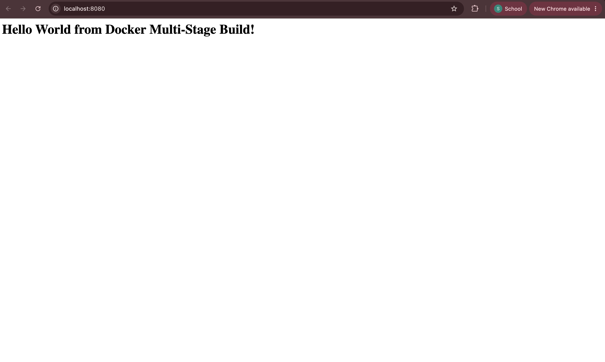

# Docker Multi-Stage Build Homework

**Name:** Suhani Awasthi  
**Enrollment Number:** 24bcs10260

## Task 1: Run Multi-Stage Dockerfile

I used the multi-stage Dockerfile provided in the teacher's repository. The project contains:

- `Dockerfile`
- `package.json`
- `server.js`

The Dockerfile uses two stages:

1. **Builder stage** - installs the Node.js dependencies and prepares the application.
2. **Production stage** - copies the required files and runs the application.

### Build Docker Image

```bash
docker build -t docker-multistage .
```

The Docker image was built successfully.

### Run the Container

The application runs on port `3000` inside the container, so I mapped it to port `8080` on my system:

```bash
docker run -d -p 8080:3000 --name docker-multistage-container docker-multistage
```

### Verify Container

```bash
docker ps
```

Output:

```text
CONTAINER ID   IMAGE               COMMAND                  STATUS
2943b715db6d   docker-multistage   "docker-entrypoint.s…"   Up
```

Port mapping:

```text
0.0.0.0:8080->3000/tcp
```

### Application Verification

I opened the application in the browser using:

```text
http://localhost:8080
```

The application displayed:

**Hello World from Docker Multi-Stage Build!**



---

## Task 2: Documentation

### Name

Suhani Awasthi

### Enrollment Number

24bcs10260

### Application Screenshot

The application was successfully accessed through `http://localhost:8080` and displayed the required Hello World message.


### Docker Container Verification

The `docker ps` command showed the multi-stage container running with port `8080` mapped to the application's port `3000`.

```text
0.0.0.0:8080->3000/tcp
```

This confirmed that the container was running successfully and the application was accessible on port `8080`.

---

## Task 3: Docker Application Deployment

I also deployed three different types of applications using Docker:

| Application | Port | Container |
|---|---:|---|
| Node.js | 3000 | `nodejs-container` |
| Python | 8000 | `python-container` |
| Java | 8080 | `java-container` |

These applications were built using Dockerfiles, run as Docker containers, and verified through their respective web pages.

## What I Learned

In this task, I learned how multi-stage Docker builds work. The build stage is used to prepare the application, while the production stage contains only what is needed to run it.

I also learned how to map a container port to a different port on my system and verify a running Docker container using `docker ps`.