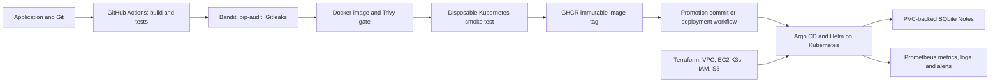

# Final DevOps project — Coursework Notes

**Suhani Awasthi · 24BCS10260**

A working Notes web application connects the course topics: Git, automated testing, Docker, security scanning, Kubernetes, Helm, cloud infrastructure, monitoring and GitOps. Code/configuration and local validation are prepared; cloud/pipeline/cluster evidence and screenshots are reserved for the practical session.



## Layout and technologies

| Directory | Contents |
|---|---|
| application | Flask API/UI, SQLite, Gunicorn, pytest, Prometheus instrumentation |
| docker | Multi-stage non-root Dockerfile |
| kubernetes | Rendered Deployment, Service, ConfigMap, dummy Secret, PVC, HPA, Ingress |
| helm | Authored parameterized chart, environment overrides, HTTP test |
| terraform | Cloud root configuration using the reusable AWS module |
| security | Scanner configurations and enforcement documentation |
| monitoring | Prometheus/Alertmanager stack, scrape settings and alert rules |
| gitops | Argo Application/AppProject, desired values and promotion workflow |
| troubleshooting | Three controlled faults and recovery procedure |

Active workflows live at repository-root `.github/workflows/` because GitHub does not execute nested workflow directories. [.github/workflows/README.md](.github/workflows/README.md) maps the final-project requirement to those files.

## Application and Docker

Follow [application setup](application/README.md) for local Python execution. From repository root:
```bash
docker build -f final-devops-project/docker/Dockerfile -t coursework-notes:local final-devops-project
docker run --rm --name coursework-notes-demo -p 127.0.0.1:8080:8080 -e DEMO_API_KEY=coursework-demo-only coursework-notes:local
```
Open localhost:8080 and enter the dummy key to create/delete notes. Reads are public within this lab. Container-only data disappears when this disposable container is removed; the Kubernetes chart supplies persistence.

## Kubernetes and Helm on Minikube

Use Docker Desktop and a single-node Minikube profile. If it has not been created, run `minikube start --driver=docker`; then `bash scripts/local-demo.sh` from root builds/loads the image, enables metrics/ingress, installs the chart and monitoring stack. Run earlier labs sequentially and clean up their resources to avoid exhausting this laptop's capacity.

Alternatively, after image loading and addon setup, `kubectl --context minikube apply -k final-devops-project/kubernetes` deploys the generated plain manifests. Choose either direct YAML or Helm for a given release; do not mix their ownership. Regenerate snapshots using `bash scripts/render-manifests.sh` after editing the chart.

```bash
kubectl --context minikube -n devops-final port-forward svc/notes 8080:80
# Browser: http://localhost:8080
# To test Ingress, in another terminal:
kubectl --context minikube -n ingress-nginx port-forward svc/ingress-nginx-controller 8086:80
curl -fsS -H 'Host: notes.local' http://localhost:8086/readyz
```

Create a note, delete a Notes Pod, wait for readiness and verify persistence. HPA uses CPU requests and metrics-server; generate `/work` requests and observe utilization/replicas. See [Session 13](../kubernetes-hpa-probes/README.md) and [Helm install/upgrade/rollback](../Helm/README.md).

SQLite on an RWO PVC is deliberately a single-node classroom design; multiple Pods on the same node share the database with transaction locking. This is not a multi-node/HA database. A production extension would move to PostgreSQL or another appropriate shared store. Startup/liveness/readiness probes, non-root execution, resource limits and configuration checksums are part of the chart.

## CI/CD and DevSecOps

The root DevSecOps workflow tests, scans, builds, scans the image, deploys it to Kind, runs HTTP tests, then publishes the exact tested image on main. All configured security gates must pass. The external-cluster workflow or GitOps promotion deploys the published image afterward. See [Session 17](../session17-devsecops-pipeline/README.md) for permissions, secrets, registry access and architecture details.

Later input needed: permission to push/run Actions; GHCR package read settings; an external cluster's namespace-scoped credentials only if using push deployment. Never commit kubeconfig/API keys. The hosted pipeline publishes amd64; Apple Silicon runs use the local arm64 build unless a multi-platform image is published separately.

## Terraform infrastructure

[terraform/README.md](terraform/README.md) explains the AWS VPC/subnet/security groups, IAM role, encrypted storage, private S3 bucket and K3s node. Configure AWS profile, region, actual operator /32 and spending limit before applying. Use Traefik ingress values on K3s. No cloud resource has been created during preparation.

## Monitoring and GitOps

[Monitoring](monitoring/README.md) covers real scrape targets, CPU/memory/request metrics, structured logs, firing/resolved alerts and health. [GitOps](gitops/README.md) covers push prerequisites, Argo installation, image promotion, drift/self-heal and rollback through Git. Metrics/logs are implemented; distributed traces are explained in Session 20 and are not falsely claimed as implemented.

## Troubleshooting, evidence and cleanup

Use [the final challenge](troubleshooting/README.md) to introduce multiple faults and document diagnosis/recovery. Use [EVIDENCE-CHECKLIST.md](../EVIDENCE-CHECKLIST.md) to collect actual run output and screenshots later. Existing expected behavior must be replaced/supplemented with observations; do not reuse the reference student's screenshots or cloud identifiers.

Stop local port-forwards after capture. Uninstall the dedicated Helm release, retain/export notes if needed, then explicitly delete its PVC and lab namespaces. Remove the GitOps Application before deleting its managed resources. Review a Terraform destroy plan and clean up only this project's AWS resources. Do not remove unrelated Docker containers or cluster resources.

## Design lessons and practical reflection

The implementation separates release configuration from images, uses immutable image tags for promotion, gates deployment on tests/scans, and distinguishes container health from storage readiness. Persistent storage and GitOps ownership require deliberate cleanup and rollback choices. These are design conclusions; add actual failures, recovery timings and lessons observed during the practical session later.
