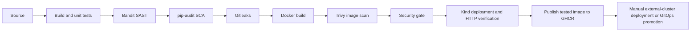

# Session 17 — Complete DevSecOps pipeline

**Suhani Awasthi · 24BCS10260**

This session evolves the shared [Notes application](../final-devops-project/application) into the final project instead of duplicating its code. The source, unit tests, [multi-stage Dockerfile](../final-devops-project/docker/Dockerfile), [Kubernetes manifests](../final-devops-project/kubernetes), and [security configurations](../final-devops-project/security) are implemented and linked here.

Active workflow: [devsecops.yml](../.github/workflows/devsecops.yml).

The disposable Kind deployment verifies the candidate before registry publication. The external-cluster/GitOps stage deploys the published image, completing the assignment's publish-then-deploy path. Neither route claims completion until its actual run is captured.

All scan steps fail closed: no `continue-on-error`, no swallowed audit errors, Trivy HIGH/CRITICAL results use exit code 1. Scanner outages fail the pipeline rather than being treated as clean results. Update vulnerable dependencies/images and rerun; do not silently lower thresholds to obtain a green check.

SAST finds unsafe source patterns; SCA finds known dependency vulnerabilities; secret scanning checks Git history with redacted output; image scanning checks OS/application packages. These tools have different coverage and do not prove absence of all vulnerabilities.

On main, a passing workflow publishes the exact tested Linux amd64 image as `ghcr.io/suhaniawasthi10/devops/notes:<commit-sha>`. PRs only test. Configure package read access for your deployment (public classroom package or an imagePullSecret for a private package). Local Apple Silicon runs use a locally built arm64 image; do not assume the CI amd64 image is a native arm64 build.

For a real target use [deploy-cluster.yml](../.github/workflows/deploy-cluster.yml): configure the coursework environment with KUBE_CONFIG_B64 and NOTES_API_KEY, a pre-created devops-release namespace, namespace-scoped deployment credentials, a default StorageClass and cluster network reachability from the runner. Alternatively use the final project's Argo CD workflow and promote the immutable image tag in Git.

Run history, security reports, registry proof and cluster screenshots are deferred. No real credentials are stored here.
