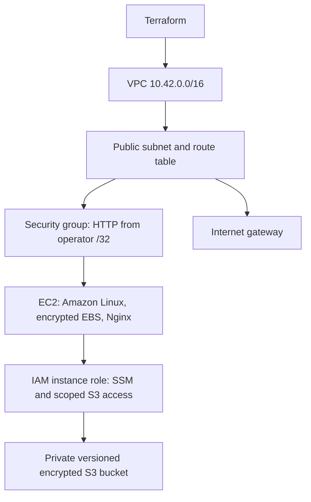

# Session 19 — Cloud infrastructure with Terraform

**Suhani Awasthi · 24BCS10260**



The reusable [cloud-lab module](../modules/cloud-lab) defines providers' resources, implicit references and an explicit route-readiness dependency before EC2 bootstrap. Root variables choose region, operator IP and optional existing SSH key. Outputs expose VPC, instance, bucket and web URL. A new VPC/subnet keeps the coursework isolated; outbound access supports package installation and SSM.

Before apply, create an ignored local.auto.tfvars with your actual public IPv4 /32 as admin_cidr. The committed loopback value intentionally does not expose the web server to the internet. SSH stays closed unless an existing key_name is supplied; Session Manager is the preferred login. The instance IAM role allows only this lab bucket's object reads/writes plus SSM. This project runs Nginx; the final project's wrapper enables K3s on a larger instance.

## Execution workflow — for the later cloud session

Configure AWS credentials locally through an AWS profile/SSO; never put access keys in tfvars or Git. Set `AWS_PROFILE` and review `aws sts get-caller-identity` before provisioning.

```bash
terraform init
terraform fmt -check
terraform validate
terraform plan -out=lab.tfplan
terraform show lab.tfplan
terraform apply lab.tfplan
terraform show
terraform output
# After verification and evidence capture:
terraform plan -destroy -out=destroy.tfplan
terraform apply destroy.tfplan
```

`init` resolves providers and state backend; `fmt` formats HCL; `validate` checks consistency; `plan` previews changes; `apply` changes AWS; `show` inspects state/plan; `output` extracts declared values; a destroy plan tears down managed resources. `terraform destroy` is the interactive shortcut for the final two commands.

Local state may contain sensitive metadata. State, saved plans, provider caches and local.auto.tfvars are ignored; commit provider lock files. Never copy someone else's state or run destroy against unrelated infrastructure. Bucket deletion fails while versioned objects remain unless you explicitly empty all versions or opt into force_destroy for disposable lab data. Cloud charges and credentials require the user's later input. No AWS apply/destroy has been run for this submission preparation.

Wait for cloud-init to finish (`sudo cloud-init status --wait` through SSM), then request the output web_url from the allowed IP. Use the instance role to demonstrate S3 upload/download of a harmless lab object; remove all object versions before teardown. Plan and apply success alone do not prove HTTP or bucket access.

Resources incur AWS charges; t3.micro is a size choice, not a free-tier guarantee. Capture the actual architecture/resources, HTTP response and teardown later.
